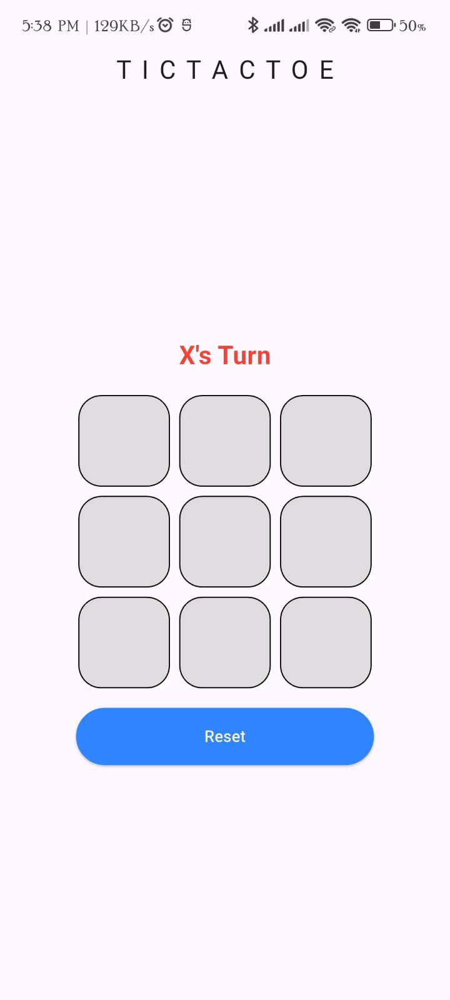
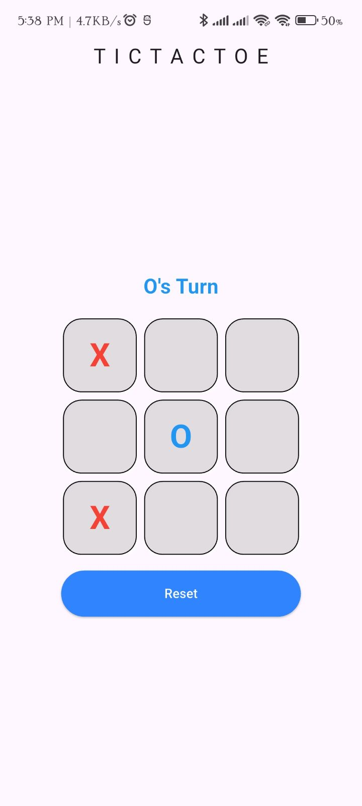
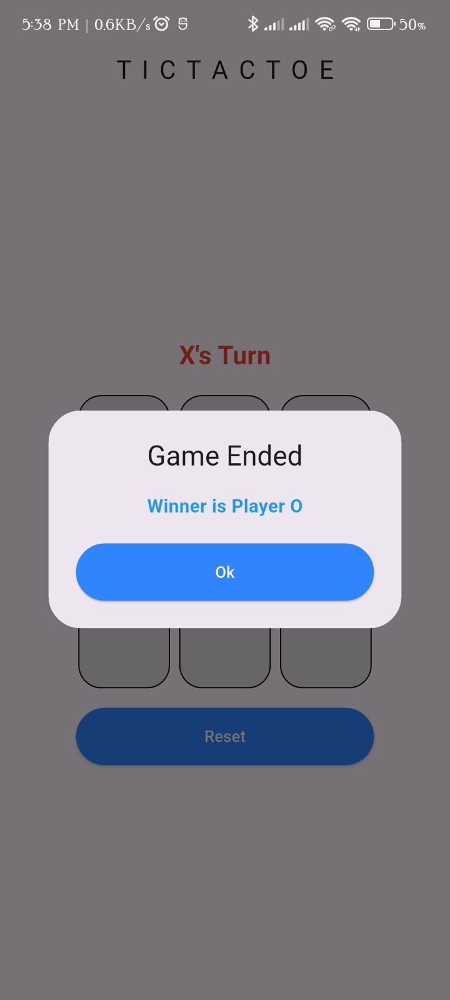

# 🕹️ Tic Tac Toe - Flutter App

A simple and fun Tic Tac Toe game built with Flutter. Play against a friend on the same device in a clean and responsive UI.

 
## ✨ Features

- Two-player mode (on the same device)
- Sleek and responsive UI
- Clear game result messages (Win)
- Restart game button
- Flutter state management (e.g., `setState`)
- Cross-platform support (Android, iOS, Web)

## 📱 Screenshots

| Home Screen                  | Game Board               | Game Over                     |
|------------------------------|--------------------------|-------------------------------|
|  |  |  |


## 🛠️ Tech Stack

- **Flutter** - UI toolkit for building natively compiled applications
- **Dart** - Programming language used for Flutter development
- **State Management** - `setState`  (based  implementation)

## 🚀 Getting Started

Follow these instructions to run the app on your local machine:

```bash
git clone https://github.com/MahmudulHasanArif14/Tic-Tac_Toe.git
cd tictactoe-flutter
flutter pub get
flutter run
